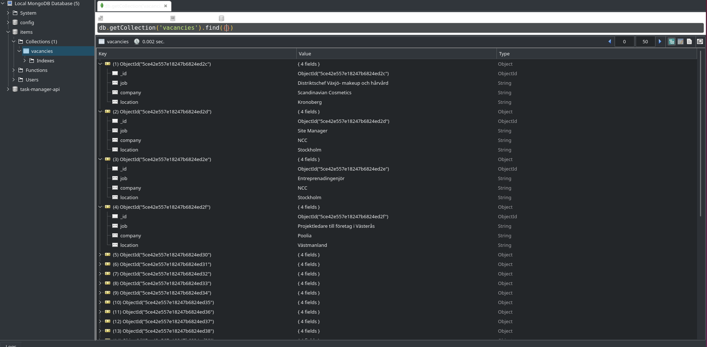

# Web Crawler

Fetches job ad information, i.e., job title, company name, and job location from the following websites:  

 - https://www.monster.se/jobb
 - https://www.stepstone.se

# Technology stack 
- Python, Scrapy framework
- Database: MongoDB

## Scrapy architecture 

Source: https://docs.scrapy.org/en/latest/topics/architecture.html

## To run the vacancies spider  

First, install the required dependencies:  

    pip install -r requirements.txt

Assuming MongoDB is installed and running locally on port 27017 (database settings can be found in vacancies/settings.py)
Run the following command:

     scrapy crawl vacancies
This will create the database "spiderjobs" that has "vacancies" collections. The "vacancies" collection will be populated with the scraped data (job, company, location). 

Alternatively, to store the scraped data into a json file:

    scrapy crawl vacancies -o <filename.json>

## Screenshot

